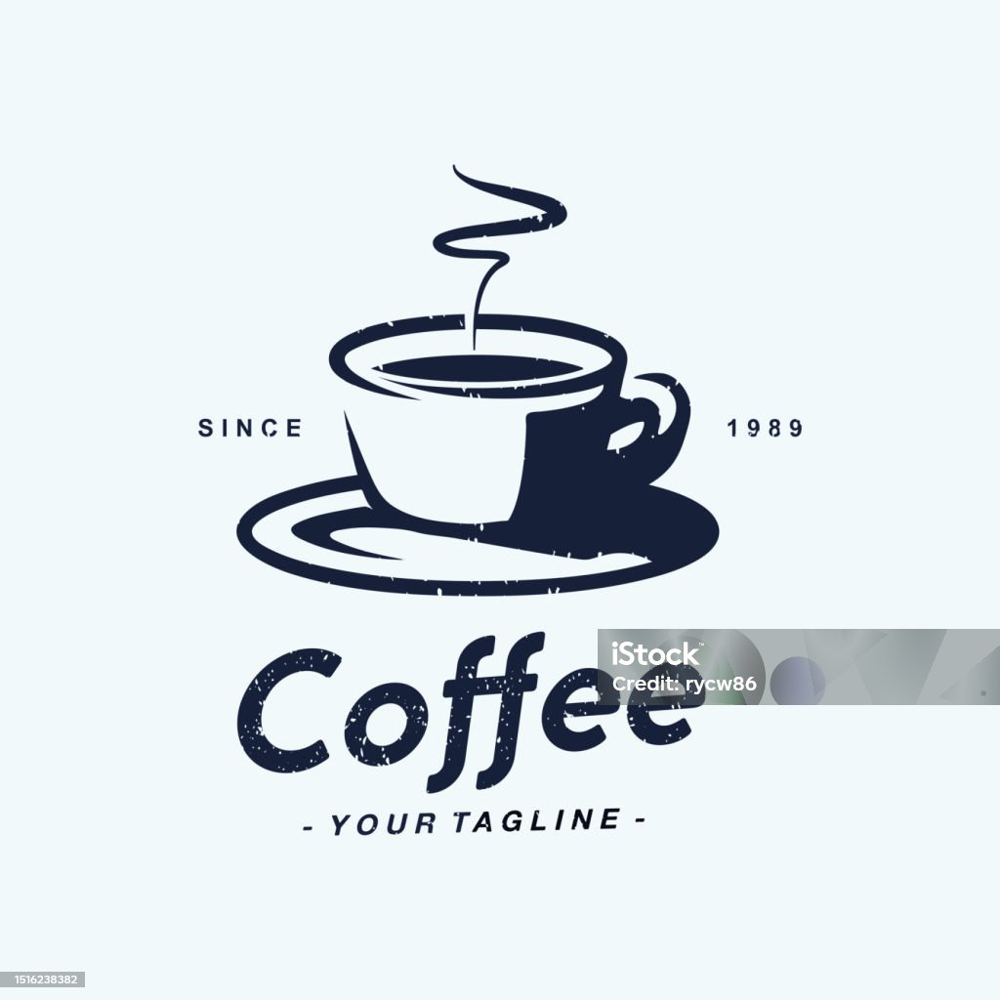
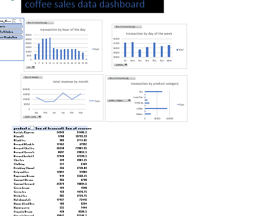
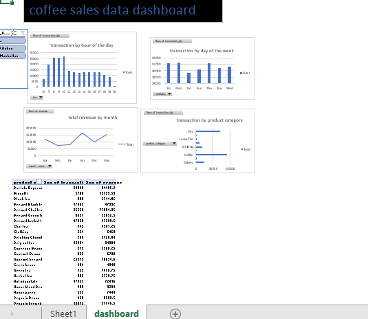

# COFFEE SHOP SALES ANALYSIS

## project overview 
Objective: The objective of this project is to analyze the sales transactions of a coffee shop located in Lower Manhattan. The goal is to gain insights into sales performance, identify the most popular products, understand revenue distribution across different categories, and determine peak sales hours. This analysis will help in making data-driven decisions to optimize inventory, enhance marketing strategies, and improve overall business operations
---
## data source/data set description 
The dataset consists of sales transactions from a coffee shop located in Lower Manhattan. The data was collected on January 1, 2023, the that was provided in an excel format and includes the following columns:
- transaction_id: A unique identifier for each transaction.
-	transaction_date: The date of the transaction.
-	transaction_time: The time the transaction occurred.
-	transaction_qty: The quantity of items purchased in the transaction.
-	store_id: The identifier for the store where the transaction took place.
-	store_location: The location of the store (Lower Manhattan).
-	product_id: The identifier for the product sold.
-	unit_price: The price per unit of the product.
-	product_category: The category to which the product belongs (e.g., Coffee, Tea, Drinking Chocolate, Bakery).
-	product_type: The type of product sold (e.g., Gourmet brewed coffee, Brewed Chai tea, Hot chocolate, Scone).
-	product_detail: Specific details about the product (e.g., Ethiopia Rg, Spicy Eye Opener Chai Lg, Dark chocolate Lg).
-	REVENUE: The total revenue generated from the transaction.
-	Month_name: The name of the month in which the transaction occurred.
-	month: The numerical representation of the month (1 for January).
-	weekday: The numerical representation of the day of the week (7 for Sunday).
-	Weekday_name: The name of the day of the week (Sunday).
-	hour: The hour at which the transaction occurred.
  ---
  ## TOOLS 
  - Microsoft Excel
     1. data cleaning
     2. data transformation
     3. data analysis
     4. dashboard
## problem Statement 
- Trend Analysis: How do sales trends vary by time of day, day of the week, or month?
- Sales Volume: What are the peak hours for sales in different store locations?
- Product Performance: Which products are the top performers in terms of sales volume and revenue?
- Purchase Patterns: What are the most common product combinations purchased together?
- Customer Segmentation: How can customers be segmented based on their purchasing behavior?  Store Performance:
- Store Comparison: How do different store locations compare in terms of sales volume and revenue?
- Performance Metrics: What are the key performance metrics for each store location?
---
## skills deployed
Data cleaning and transformation 
1. sorted and fliltered the data to remove duplicate values 
2. added the revenue column by multiplying the quantity sold and unit cost using the syntax (=H2*D2)
3. added the month-name columns by using the syntax  (=TEXT(B2,"mmm")
4. added the weekday column by using the syntax (=TEXT(B2, "dddd")
5. added the hour of the day column by using the syntax (=HOUR(C2)
# ANALYSIS 
1. Total transaction by Product Category
  - Objective: Determine the revenue contribution of each product category.
  - Pivot Table Setup:
    . Rows: product_category
    . Values: count of transaction
2. Total Revenue by Product Type
 - Objective: Identify which product types generate the most revenue.
 - 	Pivot Table Setup:
	. Rows: product_type
	. Values: Sum of REVENUE
3. Total transaction by Hour of the day
 - bjective: Analyze the distribution of sales throughout the day to identify peak hours.
       Pivot Table Setup:
       . Rows: hour
       . Values: Sum of transaction
3. Total transaction by Weekday
  - Objective: Determine which days of the week generate the most revenue.
      Pivot Table Setup:
    	.Rows: weekdayname
	. Values: Sum of transaction
4. Transaction by Product Type
 - Objective: Identify the most popular product types based on the quantity sold.
    - Pivot Table Setup:
	. Rows: product_type
	. Values: Sum of transaction_qty
Revenue by Store Location
. Objective:  the current dataset only has three store locations;
A Slicer was added to capture the different store loacations

---
## dashbord

## RESULTS AND FINDINGS 
### From the line chart 
1. The revenue shows a general upward trend from January to June.
2. There is a significant increase in revenue from February to March and from April to May.
3. The highest monthly revenue is in June with $166,485.88.
4. The lowest monthly revenue is in February with $76,145.19.
### from bar chart 
1. The highest transaction counts are for Coffee (58,416), Tea (45,449), and Bakery items (22,796).
These categories are likely the most popular or frequently purchased items.
2. Least Popular Categories:
The lowest transaction counts are for Packaged Chocolate (487) and Branded products (747).
These categories might be less popular or have lower sales volumes.
3. Mid-Range Categories:
Drinking Chocolate (11,468), Flavours (6,790), Coffee Beans (1,753), and Loose Tea (1,210) fall in the mid-range of transaction counts.
These categories have moderate popularity compared to the top and bottom categories.
4. Product Mix Analysis:
The data indicates a strong preference for beverage-related products (Coffee, Tea, and Drinking Chocolate).
Bakery items also show significant transaction volumes, suggesting they are a key product category.
### FROM the Column Chart 1
1. Peak Hours: The highest transaction quantities occur at 10 AM (26,713), 9 AM (25,370), and 8 AM (25,197). These hours are likely the busiest times of the day for transactions.
2. Least Busy Hours: The lowest transaction quantities occur at 8 PM (880) and 6 AM (6,865).
These hours are likely the least busy, possibly outside regular business hours.
### From column chart 2
1. Most Active Days: Monday (31,231), Thursday (31,162), and Friday (31,207) are the most active days in terms of transaction quantities. These days have transaction quantities exceeding 31,000.
2. Least Active Days: Saturday (29,614) has the lowest transaction quantity. This indicates a slight dip in activity compared to other days of the week.
Consistent Activity: The transaction quantities are relatively consistent across all days of the week, with values ranging from approximately 29,600 to 31,200. This suggests a stable flow of transactions throughout the week.
### FROM the pivot table 
1. Top Products by Transaction Quantity: Brewed Chai Tea (17,183 transactions) and Gourmet Brewed Coffee (16,912 transactions) are the most frequently sold products.
2. Top Products by Revenue: Barista Espresso generates the highest revenue at $91,406.20 despite not having the highest transaction count, indicating a higher price per transaction. Brewed Chai Tea and Hot Chocolate also contribute significantly to the total revenue.
3. Revenue vs. Transactions: Some products like Barista Espresso and Hot Chocolate have a higher revenue per transaction compared to others like Brewed Black Tea and Scone, which have lower revenue per transaction.
4. Product Performance: Brewed Chai Tea, Gourmet Brewed Coffee, and Barista Espresso are top performers in both transaction quantity and revenue. Products like Sugar-Free Syrup have low transaction counts and low revenue, indicating lower popularity or sales.

## OVERALL RECOMENDATIONS 
1. *Optimize High-Performing Products*:
Brewed Chai Tea, Gourmet Brewed Coffee, and Barista Espresso have high transaction counts and contribute significantly to revenue. Ensure these products are always well-stocked and consider promotions to further boost their sales.
Barista Espresso generates the highest revenue per transaction. Highlight this product in marketing campaigns to leverage its profitability.
2. *Manage Inventory and Supply Chain*:
Maintain a robust supply chain for top-selling products such as Coffee, Tea, and Bakery items to avoid stockouts.
Monitor the stock levels of Hot Chocolate, Brewed Black Tea, and Brewed Herbal Tea closely, as they also contribute significantly to sales.
3. *Evaluate and Promote Low-Performing Products*:
Products like Packaged Chocolate and Branded items have low transaction counts. Assess these products for potential discontinuation or re-promotion.
Consider promotions or bundling strategies for products like Sugar-Free Syrup and Regular Syrup to increase their sales.
4. *Leverage Peak Hours and Days*:
The data shows that 10 AM, 9 AM, and 8 AM are peak hours for transactions. Optimize staffing and operations during these hours to ensure efficient service.
Monday, Thursday, and Friday have the highest transaction volumes. Plan promotional activities or special offers on these days to capitalize on higher customer traffic.
5. *Address Slower Periods*:
Saturday has the lowest transaction quantity. Consider implementing weekend-specific promotions or events to drive traffic on this day.
Early morning (6 AM) and late evening (8 PM) hours have lower transaction volumes. Evaluate if operational adjustments (e.g., reduced staffing or hours) are needed during these times.
6. Enhance Customer Experience:
Focus on customer satisfaction and experience during peak times to retain customers and encourage repeat business.
Collect feedback on low-performing products to understand customer preferences and adjust offerings accordingly.
7. *Strategic Marketing and Promotions*:
Use the insights on high-performing products and peak transaction times to tailor marketing campaigns. For example, promote Barista Espresso and Brewed Chai Tea during morning hours.
Implement targeted promotions for mid-range products like Drinking Chocolate, Organic Brewed Coffee, and Pastry to boost their sales.
8. *Seasonal and Trend Analysis*:
Conduct further analysis to identify any seasonal trends or patterns in product sales. Use this information to plan inventory and marketing strategies for peak seasons.
Continuously monitor sales data to stay ahead of trends and adjust the product mix and marketing efforts accordingly.
### Conclusion
By focusing on high-performing products, managing inventory efficiently, leveraging peak hours and days, and strategically promoting low-performing products, the business can optimize its operations and maximize revenue. Continuous analysis and adaptation based on sales data will ensure sustained growth and customer satisfaction.
